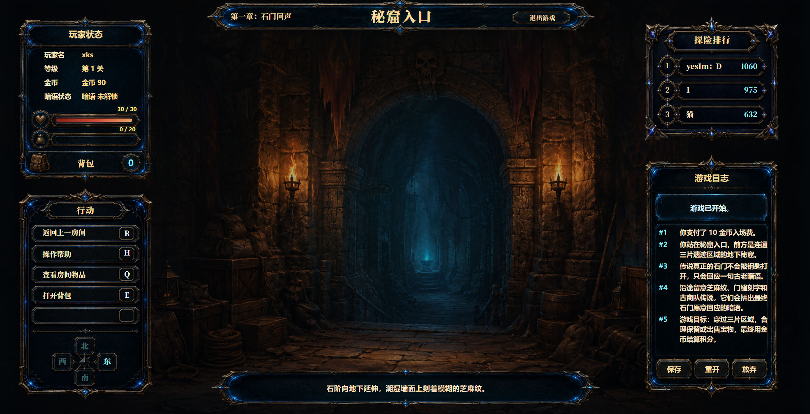
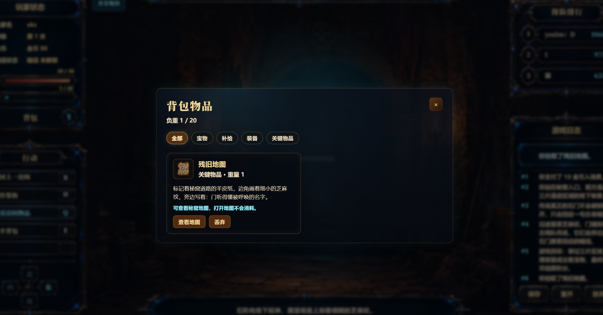
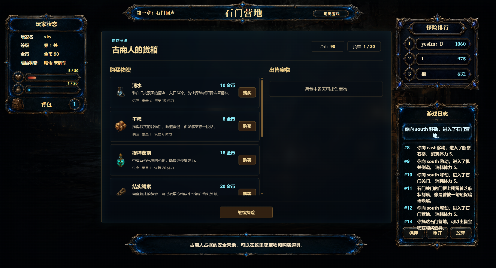
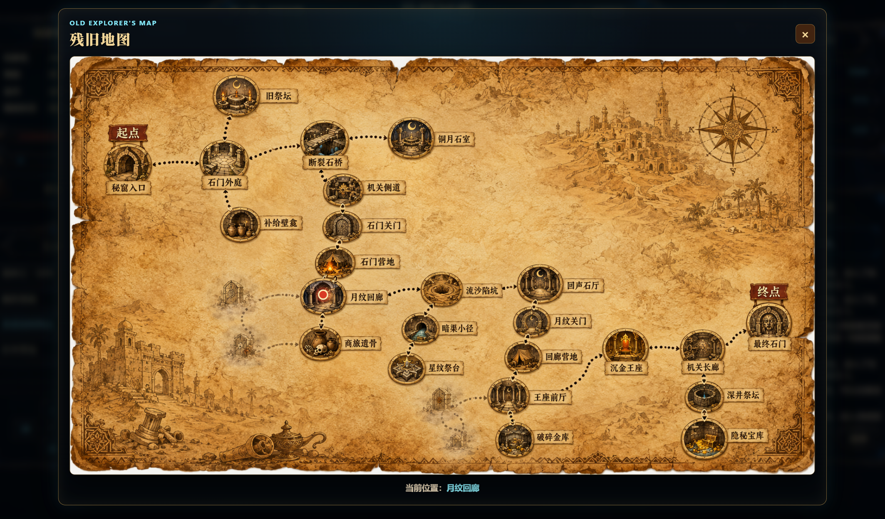
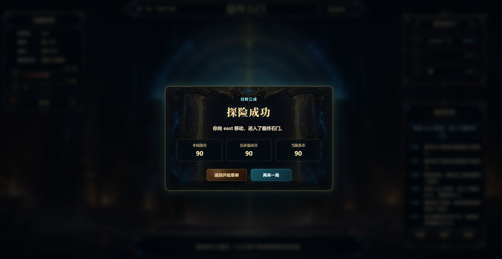

# 芝麻开门 Open Sesame

[](https://github.com/wutcst/kai-fa-kk/actions/workflows/backend-ci.yml)
[](https://github.com/wutcst/kai-fa-kk/actions/workflows/frontend-ci.yml)


《芝麻开门》是一个基于 **Vue 3 + Spring Boot + SQLite** 的前后端分离图形化文字冒险游戏。

项目以课程样例 `world-of-zuul` 为起点，围绕“神秘秘窟寻宝”主题重构为 Web 游戏。玩家需要登录账号、进入三关遗迹、管理金币/体力/负重、拾取与出售宝物、寻找暗语线索，并在最终石门前输入正确暗语完成通关。

本仓库同时展示了完整的软件工程实践过程：需求文档、Issue 拆分、分支协作、Pull Request、GitHub Actions 自动化检查、SQLite 持久化和云服务器部署。

## 目录

- [项目亮点](#项目亮点)
- [游戏玩法](#游戏玩法)
- [功能列表](#功能列表)
- [技术栈](#技术栈)
- [项目结构](#项目结构)
- [本地运行](#本地运行)
- [自动化检查](#自动化检查)
- [服务器部署](#服务器部署)
- [文档索引](#文档索引)
- [界面展示](#界面展示)
- [团队分工](#团队分工)

## 项目亮点

- **完整三关流程**：从秘窟入口到最终石门，包含跨关营地、商店补给、宝物结算和通关积分。
- **前后端分离**：前端只负责展示和交互，后端 `GameState` 是唯一权威状态来源。
- **账号与存档**：支持注册、登录、SQLite 存档、读取存档、排行榜和历史最高分。
- **资源管理玩法**：金币、体力、负重、物品重量、宝物价值共同影响玩家路线选择。
- **暗语线索链**：正确暗语不是开局直接给出，而是通过房间、物品、日志和错误提示逐步引导。
- **自动化质量保障**：后端 Checkstyle/Test/Package 与前端 Lint/Test/Build 均接入 GitHub Actions。
- **可公网访问部署**：项目已验证可部署到阿里云轻量应用服务器，通过 Nginx 对外提供页面和 API。

## 游戏玩法

玩家扮演一名寻宝者，支付入场费后进入地下秘窟。秘窟分为石门遗迹、月纹回廊和沉金王座三片区域。玩家需要在有限资源下探索房间，收集地图、钥牌、罗盘等物品，利用营地商店补给并出售宝物，最终在机关长廊输入暗语“芝麻开门”，打开最终石门。

核心规则：

- 开始游戏会扣除入场费。
- 每次移动会消耗体力。
- 物品有重量，背包不能超过负重上限。
- 宝物可以在商店出售，也可以在最终通关时结算为积分。
- 当前关体力不足时会按规则重新开始当前关。
- 存档会保存玩家位置、背包、房间物品、日志和当前游戏状态。

## 功能列表

### 后端功能

- 用户注册与登录
- 游戏会话创建与状态查询
- 三关地图、房间、出口和物品初始化
- 移动、返回上一个房间、当前关重开
- 拾取、丢弃、使用物品
- 商店商品列表、购买、出售和继续探险
- 暗语提交、错误提示和最终解锁
- SQLite 用户、存档和排行榜持久化
- JUnit 5 测试和 Checkstyle 代码规范检查

### 前端功能

- 登录/注册界面
- 开始探险、读取指定存档
- 游戏 HUD、当前房间、玩家状态和行动面板
- 背包弹窗、商店面板、帮助弹窗和结果弹窗
- 地图查看与当前位置标记
- 排行榜展示
- API 封装、错误提示和加载状态
- Vitest 测试、ESLint 检查和 Vite 构建

### 协作功能

- GitHub Issues 管理任务
- Git Flow 风格分支模型
- Pull Request 合并与检查
- GitHub Actions 自动化测试、代码检查和构建
- 服务器部署文档与发布流程记录

## 技术栈

| 类型 | 技术 |
|---|---|
| 后端 | Java 17, Spring Boot 3.3.5, Spring Web, Spring JDBC |
| 数据库 | SQLite |
| 构建与测试 | Maven, JUnit 5, Checkstyle |
| 前端 | Vue 3, Vite, Axios |
| 前端质量检查 | ESLint, Vitest |
| 自动化 | GitHub Actions |
| 部署 | 阿里云轻量应用服务器, Ubuntu 22.04, Nginx, systemd |

## 项目结构

```text
kai-fa-kk
├── backend/                    # Spring Boot 后端
│   ├── src/main/java/...       # controller、service、model、dto、persistence
│   ├── src/test/java/...       # 后端测试
│   ├── pom.xml                 # Maven 配置
│   └── checkstyle.xml          # 后端代码规范配置
├── frontend/                   # Vue 3 前端
│   ├── src/api/                # Axios 请求封装
│   ├── src/components/         # 游戏界面组件
│   ├── src/views/              # 页面入口
│   ├── src/assets/             # 图片与样式资源
│   ├── package.json            # npm 脚本与依赖
│   └── vite.config.js          # Vite 与本地代理配置
├── docs/                       # 项目文档
│   ├── requirements.md         # 需求文档
│   ├── project-plan.md         # 项目计划
│   └── server-deployment.md    # 服务器部署说明
├── .github/workflows/          # GitHub Actions 工作流
└── README.md                   # 项目说明
```

## 本地运行

### 环境要求

- Java 17
- Maven 3.6+
- Node.js 16.17+，推荐 Node.js 20
- npm

### 启动后端

```bash
cd backend
mvn spring-boot:run
```

后端默认运行在：

```text
http://localhost:8080
```

健康检查接口：

```text
http://localhost:8080/api/health
```

### 启动前端

```bash
cd frontend
npm install
npm run dev
```

前端默认运行在：

```text
http://localhost:5173
```

本地开发时，Vite 会将 `/api` 请求代理到：

```text
http://localhost:8080
```

因此推荐先启动后端，再启动前端。

## 自动化检查

本项目配置了两个 GitHub Actions 工作流。

### Backend CI

触发场景：

- push 到 `develop`、`master`、`backend/dev`、`feature/**`
- 向 `develop`、`master`、`backend/dev` 发起 Pull Request
- 手动触发 `workflow_dispatch`

执行内容：

```bash
mvn checkstyle:check
mvn test
mvn package -DskipTests
```

产物：

- 上传后端 Jar 文件作为 GitHub Actions artifact。

### Frontend CI

触发场景：

- push 到 `develop`、`master`、`frontend/dev`、`feature/**`
- 向 `develop`、`master`、`frontend/dev` 发起 Pull Request
- 手动触发 `workflow_dispatch`

执行内容：

```bash
npm ci
npm run lint
npm run test:run
npm run build
```

产物：

- 上传前端 `dist` 构建结果作为 GitHub Actions artifact。

## 服务器部署

项目已验证可部署到阿里云轻量应用服务器。

部署结构：

```text
浏览器
  |
  | HTTP 80
  v
Nginx
  |-- /              -> frontend/dist 静态页面
  └-- /api/**        -> Spring Boot 后端 8080
                           |
                           v
                      SQLite 数据库文件
```

核心部署方式：

- 后端通过 Maven 打包为可执行 Jar。
- 后端使用 `systemd` 配置为后台服务。
- 前端通过 `npm run build` 生成静态文件。
- Nginx 负责前端静态资源访问和 `/api` 反向代理。
- SQLite 数据库位于服务器后端运行目录下的 `data/sesame-open.db`。

详细步骤见：

- [服务器部署配置文档](docs/server-deployment.md)

## 文档索引

| 文档 | 说明 |
|---|---|
| [需求文档](docs/requirements.md) | 项目目标、游戏规则、功能需求和非功能需求 |
| [项目计划](docs/project-plan.md) | Issue 拆分、里程碑、分支模型和交付物 |
| [服务器部署配置文档](docs/server-deployment.md) | 阿里云服务器、Nginx、后端服务和 SQLite 部署说明 |

## 界面展示

### 首页与账号入口


首页提供注册、登录和进入游戏的入口。玩家登录后可以开始新探险，也可以读取已有存档继续游玩。

### 游戏主界面



主界面集中展示当前房间、玩家金币、体力、负重、行动方向、游戏日志和排行榜，是玩家进行探索操作的核心界面。

### 背包与物品系统



背包界面展示玩家当前携带的物品，并根据物品类型提供使用、丢弃、查看描述等操作，帮助玩家管理负重和关键道具。

### 营地商店



营地商店出现在关卡衔接阶段，玩家可以购买补给、出售宝物并继续进入下一片遗迹区域。

### 地图查看



玩家获得残旧地图后可以查看秘窟结构。地图会标记当前所在房间，辅助玩家规划探索路线。

### 通关结算



通关后系统会结算剩余金币和宝物价值，展示本次最终积分以及玩家历史最高分。

## 团队分工

| 成员 | 主要工作 |
|---|---|
| 谢恺燊 | 后端开发、核心规则、SQLite 持久化、测试、CI、文档、服务器部署 |
| 黄凯峰 | 前端初始化、页面展示、接口调用、交互弹窗、视觉素材与体验优化 |

## 开发状态

当前项目已完成核心功能开发、前后端联调、GitHub Actions 自动化检查和服务器部署验证，进入最终报告、演示视频、README 完善和发布整理阶段。

## 许可证与说明

本项目为武汉理工大学软件工程实践课程项目，用于课程学习、协同开发训练和项目展示。
